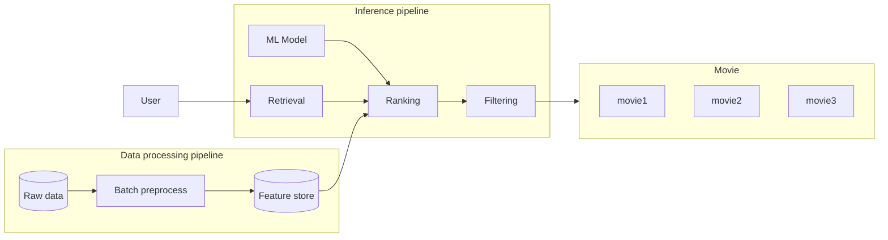

Demo recommendation app using Vertex AI and Dataflow

# Architecture

```mermaid
flowchart LR
    subgraph Movie
        movie1
        movie2
        movie3
    end
    subgraph Data processing pipeline
        direction LR
        storage1[(Raw data)] --> process1[Batch preprocess] --> storage3[(Feature store)]
    end
    subgraph Inference pipeline
        direction LR
        ml1[ML Model] --> service2
        service1[Retrieval] --> service2[Ranking] --> service3[Filtering]
    end
    storage3 --> service2
    User --> service1
    service3 --> Movie
```